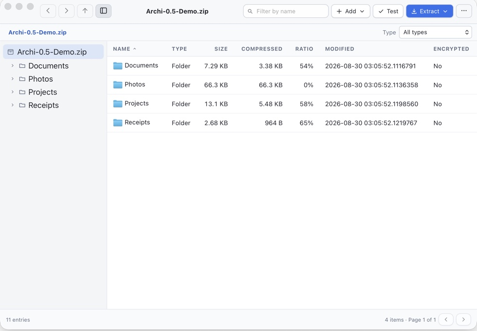

<p align="center">
  
</p>

<h1 align="center">Archi</h1>

<p align="center">
  A fast, private archive manager for macOS.
</p>

<p align="center">
  <a href="https://gg333.github.io/archi/"><strong>Website</strong></a>
  ·
  <a href="https://github.com/gg333/archi/releases/tag/v0.5.0"><strong>Download Archi 0.5.0</strong></a>
</p>

<p align="center">
  
</p>

Archi makes it easy to open, create, inspect, test, modify, and safely extract
archives without sending your files anywhere. It runs locally and uses the
bundled 7-Zip 26.02 engine for archive operations.

## Features

- Browse, filter by filename or file type, sort, and test archives before extracting them.
- Navigate large archives with a hideable, lazily loaded folder sidebar.
- Open a safe archived file in its normal Mac application, or press Spacebar for Quick Look.
- Drag a regular file from an archive directly into Finder to extract a copy there.
- Drop archives to extract them, files and folders to create an archive, or items into an open ZIP or 7z archive to add them.
- Extract an entire archive or selected files and folders.
- Create ZIP, 7z, TAR.GZ, TAR.XZ, TAR.ZST, GZIP, XZ, and Zstandard files.
- Encrypt ZIP and 7z archives with AES-256.
- Add, delete, and rename entries in ZIP and 7z archives.
- Create and extract multi-volume ZIP and 7z archives.
- Read and edit ZIP comments.
- Resolve file conflicts with Ask, Replace, Skip, or Keep Both.
- Open completed extraction destinations automatically.
- Open archives from Finder and use Finder Services for common operations.
- Cancel long-running operations and monitor progress, speed, and warnings.

## Requirements

- macOS 13 or later
- Apple Silicon or Intel Mac

Windows and Linux builds are not available yet.

## Install

1. Download `Archi_0.5.0_universal.dmg` from the
   [v0.5.0 release](https://github.com/gg333/archi/releases/tag/v0.5.0).
2. Open the DMG and drag **Archi** into **Applications**.
3. Open Archi from Applications.

The release is signed with an Apple Developer ID and notarized by Apple.

## Supported formats

Archi creates ZIP, 7z, TAR.GZ, TAR.XZ, TAR.ZST, GZIP, XZ, and Zstandard files.
It can browse and extract ZIP, 7z, RAR/RAR5, TAR, GZIP, BZIP2, XZ, AR, CPIO,
and several other formats supported by the bundled engine. Add, delete, rename,
encryption, and split-volume creation remain limited to ZIP and 7z.

RAR support is read-only; Archi does not create or modify RAR archives. See the
[supported-format matrix](docs/SUPPORTED_FORMATS.md) for operation-level details.

## Privacy and safety

Archive operations run locally. Archi has no accounts, advertising, analytics,
or usage tracking, and it does not upload archive contents, file names,
passwords, history, or diagnostics.

Extraction is staged and checked for unsafe paths, links, collisions, and source
replacement before files are installed in the destination. Read the
[security design](docs/SECURITY_DESIGN.md), [privacy statement](docs/PRIVACY.md),
and [known limitations](docs/KNOWN_LIMITATIONS.md).

## Development

Install Node.js, pnpm, Rust, and the
[Tauri prerequisites](https://v2.tauri.app/start/prerequisites/), then run:

```bash
pnpm install --frozen-lockfile
pnpm tauri dev
```

Run the automated checks with:

```bash
pnpm build
cargo fmt --check --manifest-path src-tauri/Cargo.toml
cargo clippy --locked --manifest-path src-tauri/Cargo.toml --all-targets --all-features -- -D warnings
cargo test --locked --manifest-path src-tauri/Cargo.toml
```

## Legal

Archi's source code is available under the [MIT License](LICENSE).

Archi bundles third-party software, including 7-Zip 26.02. See
[third-party notices](THIRD_PARTY_NOTICES.md) for licenses and corresponding
source information.

The Archi name, logo, and application icons are reserved brand assets of
Nitivar. See the [brand-assets policy](BRAND_ASSETS.md).
