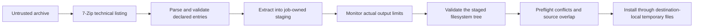

# Archi security design

This document describes the security boundaries and extraction controls in
Archi 0.5.x. It is a description of the current implementation, not a claim of
formal verification or an independent security audit.

Report suspected vulnerabilities privately as described in
[`SECURITY.md`](../SECURITY.md).

## Goals and threat model

Archi treats archive bytes, entry names, declared sizes, links, engine output,
and extracted files as untrusted. Its extraction design aims to:

- prevent archive entries from escaping the selected destination;
- reject links, special files, ambiguous names, and portable path collisions;
- bound entry count, path depth, and expanded output;
- keep unvalidated payload files away from the destination;
- avoid replacing the source archive or silently overwriting existing files;
- avoid launching executable archive entries through Open or Quick Look; and
- leave the original archive recoverable when a modification fails.

Archi trusts the installed application, the operating system, the current user
account, and its bundled 7-Zip executable. The 7-Zip process is a child process,
not an operating-system sandbox: a vulnerability in 7-Zip could execute before
Archi validates its output.

## Trust boundaries

- **WebView UI:** displays paginated metadata and progress. Archive processes,
  filesystem traversal, validation, and installation run in Rust. Tauri grants
  the main window a narrow set of event, window-drag, file-dialog,
  notification, and drag permissions.
- **Bundled engine:** 7-Zip reads untrusted archives and produces technical-list
  text or extracted files. Archi treats both as untrusted inputs.
- **Private staging:** extraction output is written to a job-owned temporary
  directory and is not installed in the selected destination until validation
  succeeds.
- **Destination filesystem:** existing names, links, filesystem semantics, free
  space, permissions, and extended-attribute support are outside Archi's
  control and are checked where the operation requires them.

## Extraction pipeline

1. **List before extracting.** Rust invokes the bundled engine and parses its
   technical listing. Lines that cannot be represented by the protocol are
   rejected rather than guessed.
2. **Validate declared metadata.** Paths must be relative, composed of safe
   components, and no deeper than 100 components. Links are rejected. Names are
   compared using Unicode normalization and case folding so entries that would
   collide on common filesystems are rejected. The declared entry ceiling is
   1,000,000.
3. **Check declared expansion.** The selected entries' declared sizes are
   compared with the configured expanded-size limit. Unknown or excessive
   totals require explicit user approval.
4. **Extract into staging.** 7-Zip writes into a job-owned temporary payload
   directory. Cancellation or a limit failure terminates the child process.
5. **Monitor actual output.** While extraction is active, Rust periodically
   walks staging and terminates extraction if actual file bytes exceed the
   configured limit. The final output is checked again after the engine exits.
6. **Validate actual output.** Archi inspects the staged filesystem tree rather
   than trusting the listing. Symbolic links, hard links, special files,
   non-Unicode paths, unsafe components, excessive depth, excessive entry count,
   and normalized collisions are rejected.
7. **Preflight the destination.** Archi resolves conflicts before installation,
   refuses to replace the source archive, and applies the selected Ask, Replace,
   Skip, or Keep Both policy.
8. **Install files safely.** Each regular file is copied into a temporary file
   created beside its final destination. New files use no-clobber persistence;
   replacement keeps a backup and restores it if installation fails.

Creating the destination directory itself may occur before the final commit,
but archive payload files are not installed until the preceding checks pass.

## Archive modification

Add, delete, rename, and comment operations work on a temporary copy beside the
source archive. Archi records the source fingerprint, validates the rewritten
archive, and refuses replacement if the source changed meanwhile. Commit keeps
a backup, replaces by rename, synchronizes the new archive and its parent
directory, and restores the original when replacement cannot be made durable.
If recovery cannot be completed automatically, the error reports the path of
the recoverable rewritten archive.

## Quarantine propagation

On macOS, Archi copies `com.apple.quarantine` from a quarantined source archive
to staging output, installed files, previews, and rewritten archives. If a
filesystem explicitly reports that extended attributes are unsupported, Archi
continues because that filesystem cannot store the attribute. Permission,
read-only, storage, and other I/O failures remain fatal.

Quarantine is an operating-system warning mechanism, not malware detection. An
archive or file without a quarantine attribute does not acquire one from Archi.

## Open and Quick Look restrictions

Open and Quick Look extract one selected entry to an owner-only preview cache.
The entry must be a regular file with a declared size within the configured
preview limit. Archi validates the extracted output and rejects directories,
links, special files, executable extensions, executable permission bits,
scripts, Mach-O files, PE files, ELF files, and Java archives. File contents are
not sent through the WebView. Preview copies are read-only with respect to the
archive and stale Archi-owned preview directories are removed on startup.

These restrictions apply to Open and Quick Look. They do not prevent users from
extracting an executable file and launching it themselves.

## Limits of this design

Archi does not claim to:

- sandbox or eliminate vulnerabilities in 7-Zip, macOS, Tauri, WebKit, or other
  dependencies;
- classify malware, scan extracted files, or guarantee that a non-executable
  document is safe for another application to open;
- prevent resource exhaustion during archive listing or when a user explicitly
  approves unbounded extraction;
- preserve every ACL, owner, extended attribute, or platform-specific metadata
  across every archive format and destination filesystem; or
- make weak archive passwords cryptographically strong.

The signed and notarized release, hardened runtime, restrictive Content
Security Policy, and narrow Tauri capabilities reduce other application risks,
but they do not turn the 7-Zip child process into an App Sandbox boundary. See
the current [`KNOWN_LIMITATIONS.md`](KNOWN_LIMITATIONS.md) for product-level
limitations.

## Implementation evidence

| Control | Source | Tests |
| --- | --- | --- |
| Extraction orchestration and declared-size gate | [`commands.rs`](../src-tauri/src/commands.rs#L67-L127) | [`commands.rs`](../src-tauri/src/commands.rs#L1099-L1162) |
| Engine listing and strict technical-list parser | [`archive.rs`](../src-tauri/src/archive.rs#L1474-L1535) | [`archive.rs`](../src-tauri/src/archive.rs#L1590-L1625) |
| Path, link, depth, entry-count, and collision validation | [`safe_paths.rs`](../src-tauri/src/safe_paths.rs#L450-L813) | [`security.rs`](../src-tauri/tests/security.rs#L29-L109) |
| Mid-extraction output monitoring and process termination | [`jobs.rs`](../src-tauri/src/jobs.rs#L211-L248), [`jobs.rs`](../src-tauri/src/jobs.rs#L331-L360) | [`jobs.rs`](../src-tauri/src/jobs.rs#L680-L721) |
| Destination preflight and safe file installation | [`safe_paths.rs`](../src-tauri/src/safe_paths.rs#L483-L523), [`safe_paths.rs`](../src-tauri/src/safe_paths.rs#L816-L1035) | [`security.rs`](../src-tauri/tests/security.rs#L112-L220) |
| Atomic, recoverable archive rewrite | [`safe_paths.rs`](../src-tauri/src/safe_paths.rs#L44-L175) | [`safe_paths.rs`](../src-tauri/src/safe_paths.rs#L1547-L1567) |
| Quarantine propagation with unsupported-filesystem fallback | [`quarantine.rs`](../src-tauri/src/safe_paths/quarantine.rs#L135-L171) | [`safe_paths.rs`](../src-tauri/src/safe_paths.rs#L1592-L1635) |
| Preview validation and executable blocking | [`safe_paths.rs`](../src-tauri/src/safe_paths.rs#L348-L449), [`safe_paths.rs`](../src-tauri/src/safe_paths.rs#L1266-L1352) | [`safe_paths.rs`](../src-tauri/src/safe_paths.rs#L1433-L1475) |
| Literal archive-entry selection without wildcard expansion | [`archive.rs`](../src-tauri/src/archive.rs#L1013-L1048) | [`security_hotfix.rs`](../src-tauri/tests/security_hotfix.rs) |
| WebView Content Security Policy and Tauri permissions | [`tauri.conf.json`](../src-tauri/tauri.conf.json#L27-L30), [`default.json`](../src-tauri/capabilities/default.json) | CI configuration: [`ci.yml`](../.github/workflows/ci.yml) |

Security documentation must change when these controls or their boundaries
change. Passing tests demonstrates the tested behavior; it is not a substitute
for external review or vulnerability reporting.
